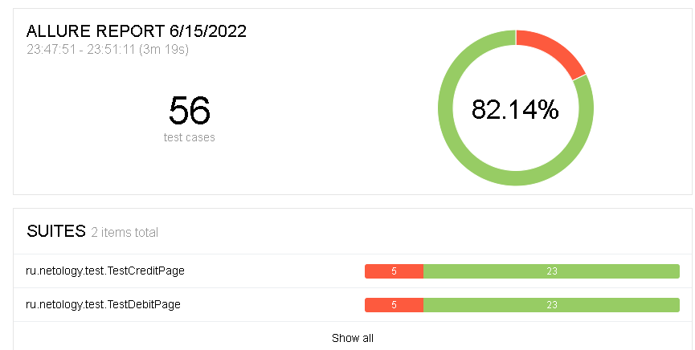

## Отчет о проведенном тестировании
____________________________________________
### Задачи
>- Провести тестирование функциональности сервиса aqa-shop.jar для покупки туров по карте или в кредит.
>- Тестирование проведено для двух БД - MySQL и PostgreSQL.

### Количество тест-кейсов
>**Всего** 56 тест-кейсов, из них:
>- passed status 46 тест-кейсов - 82,14%
>- failed status 10 тест-кейсов - 17,86%

### отчет Allure

### Рекомендации
>- Разработать спецификацию, либо другим способом оформить требования для данного приложения;
>- Исправить выявленные ошибки.